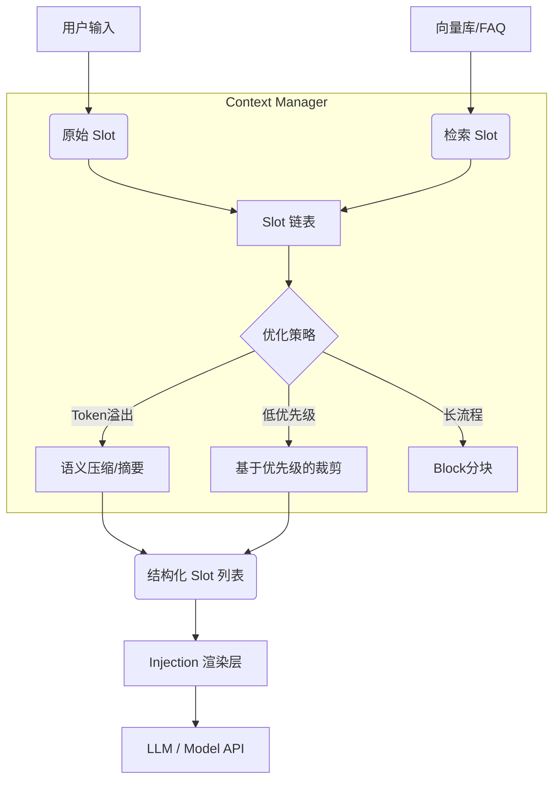

---

### 建议的仓库文件结构
在上传之前，建议您按以下结构组织文件（文件名与之前的代码示例对应）：

```text
.
├── README.md                   # 本文件
├── complete_mcp_system.py      # 【核心】完整整合版 Demo
├── examples/                   # 分步示例文件夹
│   ├── mcp_slot_demo.py                # 例2-1: 基础定义
│   ├── slot_compression_vs_retrieval.py # 例2-2: 压缩与RAG
│   ├── slot_chain_rebuild.py           # 例2-3: 链式重构
│   ├── context_block_partition.py      # 例2-4: 上下文分块
│   ├── slot_merge_operator.py          # 例2-5: 融合算子
│   ├── context_injection_demo.py       # 例2-6: Prompt注入
│   └── compress_semantic_group_demo.py # 例2-7: 语义分组
└── requirements.txt            # (可选) 依赖文件
```

---


```markdown
# MCP Context Slot Architecture 🧩

  

这是一个关于 **多Agent系统（Multi-Agent Systems）** 与 **MCP（Model Context Protocol）** 协议中核心机制——**Slot（槽位）上下文管理** 的参考实现库。

本项目展示了如何将 LLM 的上下文从简单的“字符串列表”升级为“结构化实体”，以解决长上下文遗忘、Token 预算管理、RAG 融合以及多 Agent 信息传递等工程难题。

## 📖 核心概念

在高级 Agent 开发中，上下文（Context）不应被视为静态的日志，而是一个动态的、可演化的对象集合。

- **Slot (槽位)**: 上下文的最小原子单元，包含 `Content`、`Role`、`Metadata`（元数据）和 `Priority`（优先级）。
- **Context Lifecycle (生命周期)**: 上下文经历 **构建 -> 组织 -> 演化 (压缩/裁剪) -> 渲染** 的全过程。

## 🏗️ 架构全景图

系统数据流转如下所示：



## 📂 文件说明

本项目包含循序渐进的 7 个独立示例以及 1 个完整的系统 Demo。

### 🚀 核心演示
| 文件名 | 描述 |
| :--- | :--- |
| **`complete_mcp_system.py`** | **[推荐]** 整合了下方所有特性的完整系统。模拟了用户咨询、RAG 检索、自动压缩历史、生成 Prompt 的全流程。可以直接运行查看效果。 |

### 📚 分步示例 (Examples)
| 示例 ID | 文件名 | 知识点 |
| :--- | :--- | :--- |
| **例 2-1** | `mcp_slot_demo.py` | **Slot 基础定义**：如何设计包含 Metadata 的上下文实体。 |
| **例 2-2** | `slot_compression_vs_retrieval.py` | **多态性**：区分“压缩型 Slot”与“检索型 Slot (RAG)”。 |
| **例 2-3** | `slot_chain_rebuild.py` | **生存周期**：基于优先级（Priority）和时间（Recency）的保留策略。 |
| **例 2-4** | `context_block_partition.py` | **空间管理**：长流程对话中的 Context Block（分块）设计。 |
| **例 2-5** | `slot_merge_operator.py` | **演化算子**：如何将零散信息合并（Merge）为高密度摘要。 |
| **例 2-6** | `context_injection_demo.py` | **渲染层**：将内部 Slot 对象转化为 LLM 可读的 Prompt。 |
| **例 2-7** | `compress_semantic_group_demo.py` | **语义聚合**：基于话题（Topic）的局部压缩与路由。 |

## 🛠️ 快速开始

### 1. 运行完整 Demo
无需安装额外复杂的依赖（仅需 Python 标准库），直接运行核心脚本：

```bash
python complete_mcp_system.py
```

**预期输出：**
你将看到控制台模拟了一次完整的技术支持对话：
1. 用户输入被封装为 Slot。
2. 系统自动注入知识库内容（RAG）。
3. 当对话过长时，中间的历史记录会被自动压缩为 `Summary Slot`，但保留了系统指令和最新消息。
4. 最后打印出发送给 LLM 的最终 JSON Prompt。

### 2. 在项目中使用
复制 `complete_mcp_system.py` 中的 `ContextManager` 和 `Slot` 类到你的项目中：

```python
from context_core import ContextManager, Slot

# 初始化
ctx = ContextManager(max_slots_limit=10)

# 添加消息
ctx.add_slot(Slot("用户的问题...", role="user", priority=1))

# 获取发给 API 的 Prompt
messages = ctx.get_render_prompt()
```

## 📝 学习笔记要点
1. **实体化**：不要只存字符串，要存对象。Metadata 是 Agent 协作的关键。
2. **算子化**：编写压缩（Compress）、合并（Merge）函数来对抗 Token 消耗。
3. **分层设计**：业务逻辑层操作 Slot 对象，只有在最后一步（Injection）才转为 Prompt 字符串。

---
*Created for MCP & Multi-Agent System Architecture Study.*
```